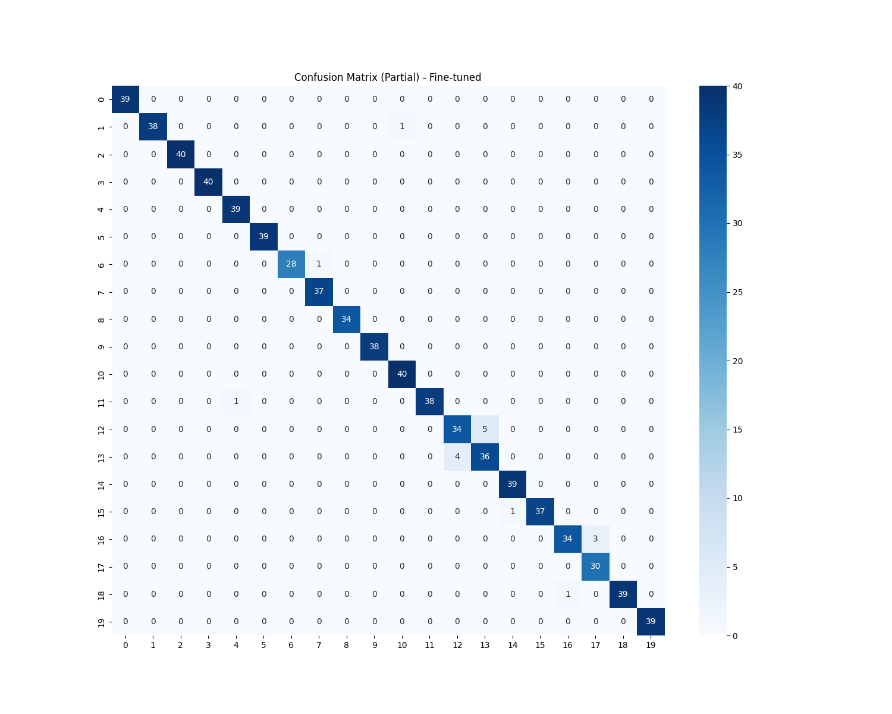
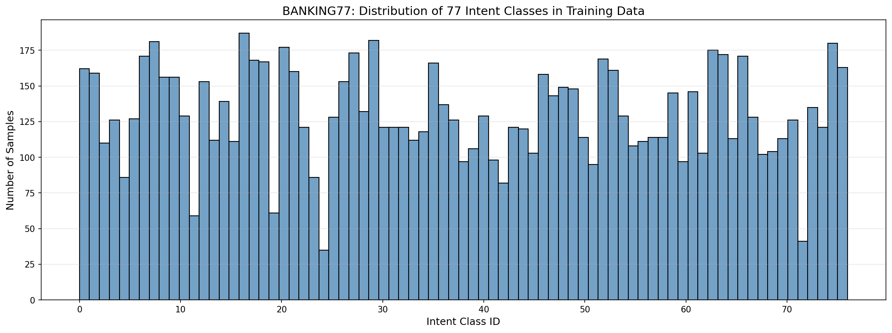

# Banking Intent Classification with Unsloth & Llama-3.1

**Course:** Applications of Natural Language Processing in Industry — Project 2  
**Institution:** VNUHCM - University of Science, Faculty of Information Technology  
**Lecturer:** Dr. Nguyen Hong Buu Long  

> Fine-tuning **Llama-3.1-8B-Instruct** on the **BANKING77** dataset for 77-class intent detection,
> powered by **Unsloth** with **QLoRA (4-bit quantization)** for memory-efficient training on a single T4 GPU.

---

## Table of Contents

1. [Project Structure](#-project-structure)
2. [Performance Results](#-performance-results)
3. [Hyperparameters Configuration](#-hyperparameters-configuration)
4. [Setup & Installation](#-setup--installation)
5. [How to Run (Pipeline)](#-how-to-run-pipeline)
6. [Python API Usage](#-python-api-usage)
7. [Video Demonstration](#-video-demonstration)
8. [References](#-references)

---

## Project Structure

```text
banking-intent-unsloth/
├── scripts/
│   ├── train.py              # SFT fine-tuning script via Unsloth + TRL
│   ├── inference.py          # Standalone IntentClassification class (§2.3)
│   ├── preprocess_data.py    # Stratified sampling, text cleaning, data splitting
│   └── evaluate.py           # Evaluation metrics + confusion matrix generation
├── configs/
│   ├── train.yaml            # All training hyperparameters and LoRA settings
│   └── inference.yaml        # Inference config (model path, system prompt)
├── sample_data/              # [Generated] Processed CSV splits from HuggingFace
│   ├── train.csv             #   Stratified sample — 80 samples × 77 classes
│   ├── val.csv               #   Validation split (15% of training set)
│   ├── test.csv              #   Independent test set (original BANKING77 test)
│   └── id2label.json         #   Integer-to-intent-name label mapping (77 entries)
├── notebooks/
│   └── banking_intent_colab.ipynb   # End-to-end Colab notebook (Highly Recommended)
├── outputs/                  # [Generated / Gitignored] Model checkpoints
│   └── banking-intent-llama31-8b/   # Saved LoRA adapter weights after training (Google Drive)
├── figures/                  # Evaluation visualizations (downloaded locally)
│   ├── eda_label_distribution.png
│   └── cm_finetuned.png      # Confusion matrix — top misclassified intent pairs
├── main.py                   # Pipeline router (--step × --env flags)
├── train.sh                  # Shell script: preprocess → train
├── inference.sh              # Shell script: run standalone inference demo
├── requirements.txt          # Pinned Python dependencies
└── README.md
```

> **Note on data & model weights:** This repository does NOT include data or model weights to keep the footprint light. All datasets are automatically downloaded from HuggingFace (`PolyAI/banking77`), and model weights are generated during the training phase. If you already have pre-trained weights, place them in the `outputs/` folder.

---

## Performance Results

All metrics were evaluated on the **original BANKING77 test set** (3,076 samples, 77 classes)
using greedy decoding (`temperature=0.1`, `do_sample=False`) with the fine-tuned LoRA adapter.

| Metric | Score |
|---|---|
| **Test Accuracy** | **92.98%** |
| **Macro F1-Score** | **~85.00%** |
| **Weighted F1-Score** | **93.00%** |
| Training Duration | ~1 h 49 min (Google Colab, T4 GPU) |
| Training Samples | 6,160 (80 samples × 77 classes, stratified) |
| Test Samples | 3,076 (original split) |

### Confusion Matrix (Top Misclassified Pairs)



### Label Distribution (EDA)



---

## Hyperparameters Configuration

All hyperparameters are persisted in [`configs/train.yaml`](configs/train.yaml).

### Model & Quantization

| Parameter | Value | Rationale |
|---|---|---|
| Base Model | `unsloth/Llama-3.1-8B-Instruct-bnb-4bit` | Unsloth dynamic 4-bit quant; strong instruction-following |
| Quantization | QLoRA (4-bit BitsAndBytes) | 4× VRAM reduction vs FP16 |
| `max_seq_length` | 512 | Banking queries are short (avg ~12 tokens) |
| `load_in_4bit` | `true` | Enables 4-bit inference |

### LoRA Adapter

| Parameter | Value | Rationale |
|---|---|---|
| `r` (rank) | 16 | Sufficient capacity for 77-class task |
| `lora_alpha` | 32 | = 2 × r (aggressive learning heuristic) |
| `lora_dropout` | 0 | Unsloth optimization for LoRA |
| `target_modules` | `q_proj, k_proj, v_proj, o_proj, gate_proj, up_proj, down_proj` | All linear layers (Unsloth best practice) |
| `bias` | `none` | Fewer trainable params, faster training |
| `use_gradient_checkpointing` | `"unsloth"` | −30% VRAM usage |

### Training Arguments

| Parameter | Value | Rationale |
|---|---|---|
| `num_train_epochs` | 3 | 1–3 recommended to avoid overfitting |
| `per_device_train_batch_size` | 2 | Conservative for T4 15 GB VRAM |
| `gradient_accumulation_steps` | 4 | Effective batch size = 2 × 4 = **8** |
| `learning_rate` | `2e-4` | Unsloth recommended starting point for LoRA/QLoRA |
| `lr_scheduler_type` | `cosine` | Smooth decay, avoids abrupt LR drops |
| `warmup_ratio` | 0.1 | 10% of steps for warmup |
| `weight_decay` | 0.01 | L2 regularization |
| `optimizer` | `adamw_8bit` | 8-bit Adam → further VRAM savings |
| `fp16` | `true` | Mixed precision on T4 (no bfloat16 support) |
| `seed` | 42 | Deterministic reproducibility |

---

## Setup & Installation

### Prerequisites

- Python 3.10+
- CUDA-capable GPU with ≥ 15 GB VRAM (NVIDIA T4 or better)

---

## How to Run (Pipeline)

### Option 1: Google Colab Notebook (Recommended)

1. Open the project's shared Google Drive link: `https://drive.google.com/drive/folders/1YZxSAINimWxQ0I9aHA3kna42NIuFhHsR?usp=sharing`
2. Click the folder name (`banking-intent-unsloth`) at the top of the screen, select **"Organize"** -> **"Add shortcut"**. Select **"My Drive"** as the destination and click **Add**.
   *(Critical: Do not rename the shortcut. It must remain exactly `banking-intent-unsloth` at the root of your My Drive).*
3. Upload the `notebooks/banking_intent_colab.ipynb` file to Google Colab.
4. Go to `Runtime` > `Change runtime type` and select **T4 GPU**.
5. Click `Runtime` > `Run all`.

**How it works:** The notebook automatically mounts Google Drive. Because you added the shortcut to your root directory, the Colab environment perfectly resolves the path `/content/drive/MyDrive/banking-intent-unsloth`. It will load the LoRA adapter and run the inference demo seamlessly from start to finish.

---

### Option 2: Local Execution (From Scratch)

If you have a dedicated GPU (e.g., RTX 3060/4060 12GB+) and want to run it locally, follow these steps:

#### 1. Setup Environment
```bash
git clone https://github.com/thong7d/banking-intent-unsloth.git
cd banking-intent-unsloth

# Create a virtual environment
python -m venv venv && source venv/bin/activate   # Linux/macOS
# On Windows (PowerShell): venv\Scripts\Activate.ps1

# Install dependencies
pip install --upgrade pip
pip install -r requirements.txt
```

#### 2. Run Pipeline

All pipeline steps are accessible through the central **`main.py`** router or convenience shell scripts. The `--env local` flag (default) ensures everything is saved relative to your project directory.

**A. Using Shell Scripts (Easiest)**

```bash
# This downloads the dataset, preprocesses it, and trains the model (~1h 49m)
bash train.sh

# After training finishes, run the inference demo
bash inference.sh
```

**B. Using `main.py` (Step-by-step)**

```bash
# Step 1 — Preprocess data: Downloads BANKING77 from HuggingFace and creates splits
python main.py --step preprocess --env local

# Step 2 — Fine-tune the model: Loads Llama-3.1 and trains on the splits
python main.py --step train --env local

# Step 3 — Evaluate on test set
python main.py --step evaluate --env local

# Step 4 — Run inference demo
python main.py --step infer --env local
```

---

## Python API Usage

The `IntentClassification` class in `scripts/inference.py` provides a clean, standalone API
that satisfies the §2.3 interface requirement (`__init__` + `__call__`).

```python
import sys
sys.path.insert(0, ".")          # run from project root

from scripts.inference import IntentClassification

# --- Initialize ---
# model_path points to configs/inference.yaml, which contains
# the path to the saved LoRA checkpoint and system prompt.
classifier = IntentClassification(
    config_path="configs/inference.yaml",
    checkpoint_dir="outputs/banking-intent-llama31-8b",  # override if needed
    data_dir="sample_data",                              # folder containing id2label.json
)

# --- Single query ---
label = classifier("I am still waiting on my card?")
print(label)   # → card_arrival

# --- Multiple queries ---
queries = [
    "How do I change my PIN?",
    "There's a transaction I don't recognize",
    "Can you tell me the exchange rate for USD to EUR?",
    "I want to close my account",
]
for q in queries:
    print(f"[{classifier(q):40s}]  {q}")
```

**Constructor signature:**

```python
IntentClassification(
    config_path: str,           # Path to configs/inference.yaml
    checkpoint_dir: str = None, # Overrides config's checkpoint_path (optional)
    data_dir: str = None,       # Overrides config's data_dir (optional)
)
```

**`__call__` signature:**

```python
predicted_label: str = classifier(message: str)
# Returns the matched intent name (77 possible values).
# Includes fuzzy-matching fallback for hallucinated label formats.
```

---

## Video Demonstration

> **https://drive.google.com/drive/folders/1GkdYiOa56Mwb2G6HrtAeYdVmN7WTG7Bs?usp=sharing**

---

## References

```bibtex
@inproceedings{Casanueva2020,
  author    = {Casanueva, I{\~{n}}igo and Tem{\v{c}}inas, Tadas and Gerz, Daniela
               and Henderson, Matthew and Vuli{\'c}, Ivan},
  title     = {Efficient Intent Detection with Dual Sentence Encoders},
  booktitle = {Proceedings of the 2nd Workshop on NLP for ConvAI -- ACL 2020},
  year      = {2020},
  url       = {https://arxiv.org/abs/2003.04807}
}

@article{Hu2022LoRA,
  author  = {Hu, Edward J. and Shen, Yelong and Wallis, Phillip and Allen-Zhu, Zeyuan
             and Li, Yuanzhi and Wang, Shean and Wang, Lu and Chen, Weizhu},
  title   = {{LoRA}: Low-Rank Adaptation of Large Language Models},
  journal = {ICLR 2022},
  year    = {2022},
  url     = {https://arxiv.org/abs/2106.09685}
}

@inproceedings{Dettmers2023QLoRA,
  author    = {Dettmers, Tim and Pagnoni, Artidoro and Holtzman, Ari and Zettlemoyer, Luke},
  title     = {{QLoRA}: Efficient Finetuning of Quantized {LLM}s},
  booktitle = {NeurIPS 2023},
  year      = {2023},
  url       = {https://arxiv.org/abs/2305.14314}
}
```

- **BANKING77 Dataset:** [PolyAI/banking77](https://huggingface.co/datasets/PolyAI/banking77) — CC BY 4.0
- **Unsloth Documentation:** [unsloth.ai/docs](https://unsloth.ai/docs)
- **Base Model:** [meta-llama/Llama-3.1-8B-Instruct](https://huggingface.co/meta-llama/Llama-3.1-8B-Instruct)
